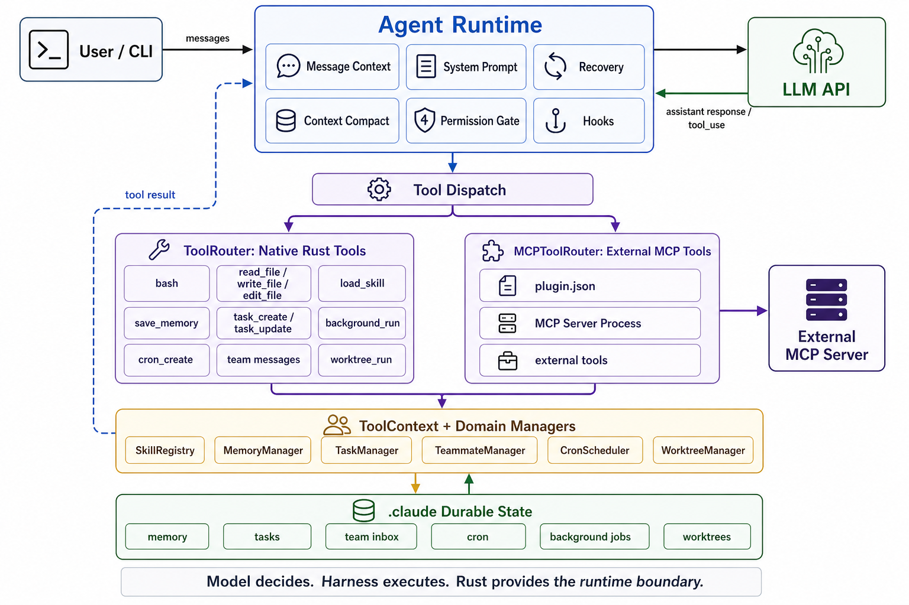

[](https://github.com/wulawulu/learn-claude-code-rs/actions/workflows/ci.yml)
# learn-claude-code-rs

[English](./README.md) | 中文

一个用 Rust 编写的渐进式 AI Agent Harness 教程。

这个仓库是一条面向 Rust 生态的 Agent Harness 学习路线：从最小的 agent loop 开始，逐步加入工具系统、任务规划、子代理、技能、上下文压缩、权限、hook、memory、多 agent 协作、worktree 隔离、MCP/plugin 和工具路由等能力。

本项目受到 [shareAI-lab/learn-claude-code](https://github.com/shareAI-lab/learn-claude-code/tree/main) 启发。章节设计、部分内容组织和代码思路都一定程度参考了该项目，并在 Rust 生态下重新实现和调整；它不是逐字照搬或简单移植，而是围绕 agent harness 这个领域本身重新梳理。

每一章都是一个可运行的 Rust crate。你可以按顺序阅读，也可以直接进入某个主题目录，观察一个 agent harness 功能如何被拆成数据结构、运行循环、工具接口和持久化状态。

## 为什么是这个项目

很多 LLM 示例停留在 tool calling。本项目关注模型之外的 runtime 工程：

- 工具派发
- 权限系统
- 技能加载
- 记忆系统
- 上下文压缩
- 子代理
- 后台任务
- 团队协议
- worktree 隔离
- MCP 插件
- 强类型工具路由

## 架构图



## 适合谁

- 想理解 coding agent 内部机制，而不只是调用现成产品的人。
- 想用 Rust 写 AI Agent、CLI 工具、自动化工程工具的人。
- 已经了解 LLM API，但想系统学习 tool use、subagent、permission、hook、memory 等工程结构的人。
- 对 Claude Code、Codex、Devin、Cursor Agent 等 coding agent 背后的基础架构感兴趣的人。

## 快速开始

准备 Rust 环境：

```bash
rustup update
cargo --version
```

配置模型 API。当前示例代码使用 Anthropic SDK 的接口形式，并通过环境变量配置 key 和 base url：

```bash
cp .env.example .env
```

然后把 `.env` 中的占位符替换成自己的配置：

```bash
ANTHROPIC_API_KEY=your_api_key
ANTHROPIC_BASE_URL=your_anthropic_compatible_base_url
```

运行第一章：

```bash
cargo run -p s01_agent_loop
```

运行完整版本：

```bash
cargo run -p sfull
```

检查整个工作区：

```bash
cargo check --workspace
```

## 学习路线

每一章都是一个独立 crate，可以单独运行、阅读和修改。建议按顺序学习，因为后面的章节通常建立在前面章节的架构之上。

| 章节 | 目录 | 主题 | 说明 |
| --- | --- | --- | --- |
| 01 | [`s01_agent_loop`](./s01_agent_loop) | Agent Loop | 最小可运行 agent：接收用户输入、调用模型、处理响应，并支持基础 bash 工具。配套文档见 [`s01.md`](./s01_agent_loop/s01.md)。 |
| 02 | [`s02_tool_use`](./s02_tool_use) | Tool Use | 把工具抽象成统一 trait，引入 `read_file`、`write_file`、`edit_file` 等工具。配套文档见 [`s02.md`](./s02_tool_use/s02.md)。 |
| 03 | [`s03_todo_write`](./s03_todo_write) | Todo Planning | 增加 todo 工具，让 agent 能维护任务计划和执行状态。配套文档见 [`s3.md`](./s03_todo_write/s3.md)。 |
| 04 | [`s04_subagent`](./s04_subagent) | Subagent | 通过 task 工具启动子代理，将探索或子任务委派出去。配套文档见 [`s4.md`](./s04_subagent/s4.md)。 |
| 05 | [`s05_skill_loading`](./s05_skill_loading) | Skill Loading | 从 `skills/` 目录加载专业技能，把技能内容注入 agent 的上下文。配套文档见 [`s05.md`](./s05_skill_loading/s05.md)。 |
| 06 | [`s06_context_compact`](./s06_context_compact) | Context Compact | 在上下文变长时压缩消息，保留关键状态，减少无效历史。配套文档见 [`s06.md`](./s06_context_compact/s06.md)。 |
| 07 | [`s07_permission_system`](./s07_permission_system) | Permission | 引入权限模式，对工具调用做交互式确认或自动批准。配套文档见 [`s07.md`](./s07_permission_system/s07.md)。 |
| 08 | [`s08_hook_system`](./s08_hook_system) | Hook System | 在 agent 生命周期中加入 hook，让工具执行前后、消息处理等阶段可扩展。配套文档见 [`s08.md`](./s08_hook_system/s08.md)。 |
| 09 | [`s09_memory_system`](./s09_memory_system) | Memory | 增加记忆机制，让 agent 能跨轮次保留偏好和长期信息。配套文档见 [`s09.md`](./s09_memory_system/s09.md)。 |
| 10 | [`s10_system_prompt`](./s10_system_prompt) | System Prompt | 系统化管理 prompt，拆分身份、环境、工具约束和行为规范。配套文档见 [`s10.md`](./s10_system_prompt/s10.md)。 |
| 11 | [`s11_error_recovery`](./s11_error_recovery) | Error Recovery | 处理工具失败、模型输出异常和可恢复错误，让 agent 更稳定。配套文档见 [`s11.md`](./s11_error_recovery/s11.md)。 |
| 12 | [`s12_task_system`](./s12_task_system) | Task System | 把任务抽象成更明确的结构，为后台任务和复杂调度做准备。配套文档见 [`s12.md`](./s12_task_system/s12.md)。 |
| 13 | [`s13_background_tasks`](./s13_background_tasks) | Background Tasks | 支持后台任务，让 agent 可以启动、查询和管理长期运行的工作。配套文档见 [`s13.md`](./s13_background_tasks/s13.md)。 |
| 14 | [`s14_cron_scheduler`](./s14_cron_scheduler) | Cron Scheduler | 让 agent 能安排未来任务，并在触发时重新注入主循环。配套文档见 [`s14.md`](./s14_cron_scheduler/s14.md) 和 [`cron_rs_explained.md`](./s14_cron_scheduler/cron_rs_explained.md)。 |
| 15 | [`s15_agent_teams`](./s15_agent_teams) | Agent Teams | 组织多个 agent 形成团队，拆分角色、inbox 和消息协作。配套文档见 [`s15.md`](./s15_agent_teams/s15.md)。 |
| 16 | [`s16_team_protocols`](./s16_team_protocols) | Team Protocols | 为多 agent 协作定义通信协议和协作流程。配套文档见 [`s16.md`](./s16_team_protocols/s16.md)。 |
| 17 | [`s17_autonomous_agents`](./s17_autonomous_agents) | Autonomous Agents | 实现长期运行的 autonomous worker、idle polling 和 task claim。配套文档见 [`s17.md`](./s17_autonomous_agents/s17.md)。 |
| 18 | [`s18_worktree_task_isolation`](./s18_worktree_task_isolation) | Worktree Isolation | 用 git worktree 隔离任务执行环境，降低多任务修改互相污染的风险。配套文档见 [`s18.md`](./s18_worktree_task_isolation/s18.md)。 |
| 19 | [`s19_mcp_plugin`](./s19_mcp_plugin) | MCP Plugin | 把 MCP/plugin 工具接入 agent harness，并复用同一套权限和 tool result 回路。配套文档见 [`s19.md`](./s19_mcp_plugin/s19.md)。 |
| 20 | [`s20_tool_refactor`](./s20_tool_refactor) | Tool Refactor | 重构工具注册、路由和派发机制，并引入宏辅助。配套文档见 [`s20.md`](./s20_tool_refactor/s20.md)，设计记录见 [`tool-router-design.zh.md`](./s20_tool_refactor/tool-router-design.zh.md)。 |
| Full | [`sfull`](./sfull) | 完整版本 | 将前面章节的能力整合到一个完整 agent harness 中。配套文档见 [`sfull.md`](./sfull/sfull.md)。 |

## 推荐阅读方式

如果你是第一次接触 agent harness，建议这样读：

1. 先运行 `s01_agent_loop`，理解最小闭环：用户输入、模型响应、工具调用、结果回填。
2. 阅读 `s02_tool_use` 到 `s04_subagent`，理解 coding agent 最核心的三个能力：工具、计划、委派。
3. 阅读 `s05_skill_loading` 到 `s08_hook_system`，理解如何把 agent 从 demo 变成可扩展系统。
4. 阅读 `s09_memory_system` 到 `s14_cron_scheduler`，理解状态、长期任务和调度。
5. 阅读 `s15_agent_teams` 到 `s20_tool_refactor`，理解多 agent、隔离执行、插件化和工具路由。
6. 最后看 `sfull`，把前面的设计串起来。

## 项目结构

```text
.
├── Cargo.toml                    # Rust workspace 配置
├── s01_agent_loop/               # 最小 agent loop
├── s02_tool_use/                 # 工具抽象
├── s03_todo_write/               # 任务规划
├── s04_subagent/                 # 子代理
├── s05_skill_loading/            # 技能加载
├── s06_context_compact/          # 上下文压缩
├── s07_permission_system/        # 权限系统
├── s08_hook_system/              # hook 系统
├── s09_memory_system/            # memory 系统
├── s10_system_prompt/            # system prompt 管理
├── s11_error_recovery/           # 错误恢复
├── s12_task_system/              # task 抽象
├── s13_background_tasks/         # 后台任务
├── s14_cron_scheduler/           # cron 调度
├── s15_agent_teams/              # agent teams
├── s16_team_protocols/           # 团队协议
├── s17_autonomous_agents/        # 自主 agent
├── s18_worktree_task_isolation/  # worktree 任务隔离
├── s19_mcp_plugin/               # MCP/plugin
├── s20_tool_refactor/            # 工具系统重构
├── s20_tool_refactor_macros/     # 工具宏
├── sfull/                        # 完整整合版本
└── skills/                       # 示例技能
```

## 常用命令

运行某一章：

```bash
cargo run -p s03_todo_write
```

运行完整版本：

```bash
cargo run -p sfull
```

检查代码：

```bash
cargo check --workspace
```

运行测试：

```bash
cargo test --workspace
```

格式化：

```bash
cargo fmt --all
```

## 致谢

本项目的部分 Rust 工程化思路受到 [bosun-ai/swiftide](https://github.com/bosun-ai/swiftide) 启发，尤其是 hook 和 system prompt 相关机制。

## 贡献

欢迎对 Rust、AI Agent、tool use、MCP、coding agent 感兴趣的朋友一起讨论和改进。

可以贡献的方向包括：

- 修正文档里不清楚或过时的部分。
- 补充每一章的讲解、图示或示例。
- 改进代码结构和错误处理。
- 增加更多测试。
- 尝试接入更多模型、工具或 MCP server。
- 把中文 README 翻译成英文。

## License

本项目采用 MIT License。

如果你使用、修改或传播本项目，请保留对应的 license 信息。
